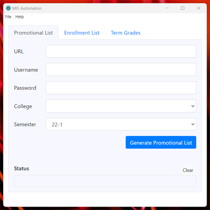
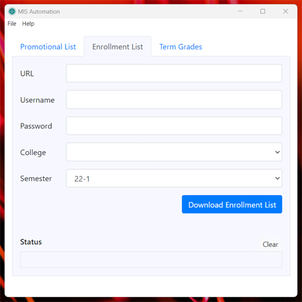

# MIS Automation

Automation software. A GUI app, automates the generation of promotional list, enrollment list and term grades.

***

[Automatic!](https://raw.githubusercontent.com/gsu-edu-ph-mis/mis-automation/master/images/otomatic.mp4)

***
## Screenshots

Sample screenshots

## Installation

### Windows:

Download and extract [zip file](https://github.com/gsu-edu-ph-mis/mis-automation/releases/download/1.0.0/mis-automation-win32-x64.zip) and run `mis-automation.exe`

## Development

### Prerequisites

* nodejs 16 or later
* git
* A fast and stable internet connection for npm install.

Run the following commands from the termninal (cmd on windows, bash on mac)

1. Clone repo:

        git clone https://github.com/gsu-edu-ph-mis/mis-automation.git

1. Change to project directory

        cd mis-automation

1. Install

        npm install

    *Note: Might take some time as it will download browser binaries that are 100MB or more*

1. Run

        npm start

## Packaging

    npm install --save-dev @electron-forge/cli
    npx electron-forge import
    npm run make

Get binaries from the `out` directory